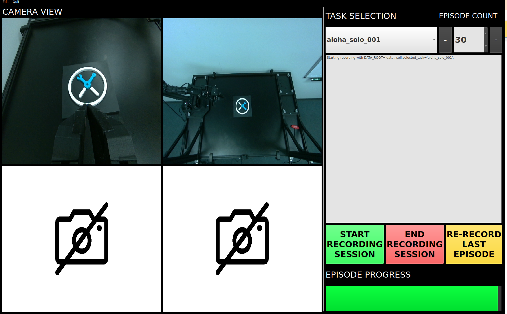

Trossen Aloha UI
================

Overview
--------

**Trossen Aloha UI** is a Python-based application designed for seamless and efficient robotic data collection.
It provides an intuitive GUI to manage robot configurations, perform task recordings, and streamline data collection with advanced features like camera views, task management, and progress tracking.

Pre-Installation Setup
----------------------

Before installing the application, complete the following setup:

#. Install Miniconda:
   Download and install `Miniconda <https://docs.conda.io/en/latest/miniconda.html>`_ for your operating system.

#. Create a Virtual Environment:
   Use Miniconda to create a virtual environment:

   .. code-block:: bash

      conda create -n aloha_env python=3.10 -y
      conda activate aloha_env

Installation
------------

Install **Trossen Aloha UI** directly using `pip`:

.. code-block:: bash

   pip install trossen_aloha_ui

Post-Installation
-----------------

After installation, run the following command to set up the application:

- Clones and installs required dependencies for `lerobot`.
- Resolves common issues with OpenCV and video encoding.
- Creates a desktop icon for launching the application.

.. code-block:: bash

   post_install

Launching the Application
-------------------------

Desktop Application
^^^^^^^^^^^^^^^^^^^

After installation, a desktop shortcut named **Trossen Aloha UI** is available. Click on it to launch the application.

Command Line
^^^^^^^^^^^^

Alternatively, you can run the application directly from the terminal:

.. code-block:: bash

   trossen_aloha_ui

Application Features
--------------------

#. Task Management:

   - Task Names: Select predefined tasks from the dropdown menu.
   - Episodes: Specify the number of episodes using the spin box. Adjust the count using the `+` and `-` buttons.

#. Recording Controls:

   - Start Recording: Initiates data collection for the selected task.
   - Stop Recording: Stops the current data collection session.
   - Re-Record: Allows re-recording of the current episode if necessary.

#. Progress Tracking:

   - A progress bar tracks the recording session in real-time, displaying completion percentage.

#. Camera Views:

   - View multiple camera feeds in real-time during recording for better monitoring.

#. Configuration Management:

   - Edit Robot Configuration: Modify the robot's YAML configuration for granular control.
   - Edit Task Configuration: Adjust task-specific parameters via a YAML editor.

#. Quit Button:

   - Use the Quit button in the menu to gracefully exit the application.

Configuration Management
------------------------

The **Trossen Aloha UI** application provides two primary configuration files for setup:

#. Task Configuration: Used to manage task-specific parameters like task names, episode lengths, warmup times, and more.
#. Robot Configuration: Used to define arm and camera settings, motor limits, and safety parameters.

Task Configuration
^^^^^^^^^^^^^^^^^^

Task-specific parameters are stored in the `tasks_config.yaml` file. Below is an example configuration:

.. code-block:: yaml

   tasks:
     - task_name: "aloha_solo_dummy"
       episode_length_s: 12
       warmup_time_s: 1
       reset_time_s: 5
       hf_user: "YourUser"
       fps: 30
       push_to_hub: false

     - task_name: "aloha_mobile_dummy"
       episode_length_s: 15
       warmup_time_s: 5
       reset_time_s: 10
       hf_user: "YourUser"
       fps: 30
       push_to_hub: false

     - task_name: "aloha_stationary_dummy"
       episode_length_s: 9
       warmup_time_s: 5
       reset_time_s: 5
       hf_user: "YourUser"
       fps: 30
       push_to_hub: false

**Key Fields**

- **task_name**: A unique identifier for the task. Ensure no duplicate task names exist.
- **episode_length_s**: Duration of each episode in seconds.
- **warmup_time_s**: Time in seconds for the system to warm up before starting the episode.
- **reset_time_s**: Time in seconds for the system to reset after each episode.
- **hf_user**: Your Hugging Face username to associate with the dataset.
- **fps**: Frames per second for recording data.
- **push_to_hub**: Set to `true` to upload datasets automatically to Hugging Face Hub. Ensure Hugging Face authentication is set up if this is enabled.

Hugging Face Authentication
^^^^^^^^^^^^^^^^^^^^^^^^^^^

To enable dataset uploads to the Hugging Face Hub, set up authentication using the following guide:  
`Hugging Face Authentication Guide <https://huggingface.co/docs/huggingface_hub/en/quick-start#authentication>`_

Robot Configuration
^^^^^^^^^^^^^^^^^^^

The robot's settings are defined in a YAML file (e.g., `aloha_solo.yaml`).
Below is a simplified version of a robot configuration file:

.. code-block:: yaml
   :emphasize-lines: 5,10,21,32,38

   _target_: lerobot.common.robot_devices.robots.manipulator.ManipulatorRobot
   robot_type: aloha
   calibration_dir: trossen_aloha_ui/configs/calibration/aloha_default

   max_relative_target: null  # Set to null for more precise control once comfortable

   leader_arms:
     right:
       _target_: lerobot.common.robot_devices.motors.dynamixel.DynamixelMotorsBus
       port: /dev/ttyDXL_leader_right
       motors:
         waist: [1, xm430-w350]
         shoulder: [2, xm430-w350]
         elbow: [4, xm430-w350]
         wrist_rotate: [8, xl430-w250]
         gripper: [9, xc430-w150]

   follower_arms:
     right:
       _target_: lerobot.common.robot_devices.motors.dynamixel.DynamixelMotorsBus
       port: /dev/ttyDXL_follower_right
       motors:
         waist: [1, xm540-w270]
         shoulder: [2, xm540-w270]
         elbow: [4, xm540-w270]
         wrist_rotate: [8, xm430-w350]
         gripper: [9, xm430-w350]

   cameras:
     cam_right_wrist:
       _target_: lerobot.common.robot_devices.cameras.intelrealsense.IntelRealSenseCamera
       serial_number: 218622272670
       fps: 30
       width: 640
       height: 480
     cam_top:
       _target_: lerobot.common.robot_devices.cameras.intelrealsense.IntelRealSenseCamera
       serial_number: 128422271347
       fps: 30
       width: 640
       height: 480

**Key Fields**

- **max_relative_target**: Limits the motion range of motors for safety. Set to `null` for precise control after gaining confidence.
- **leader_arms / follower_arms**: Specifies motor configurations for both leader and follower arms, including ports and motor models.
- **cameras**: Configures Intel RealSense cameras with serial numbers, frame rates, and resolutions.

#. **Set Ports for Arms**: Update the `port` fields for `leader_arms` and `follower_arms` based on the symbolic links set for the robotic arms.

#. **Add Serial Numbers for Cameras**: Use the Intel RealSense Viewer to obtain and add the correct serial numbers for each camera under the `cameras` section.

#. **Verify Calibration**: Ensure the `calibration_dir` points to the appropriate calibration files.

Once the above configurations are completed, your setup is ready for teleoperation, data recording, and other tasks.

Hardware Setup
--------------

For detailed instructions on the hardware setup, please refer to the official documentation:  
:ref:`getting_started/solo/software_setup:Post-Install Hardware Setup`.

This guide provides comprehensive information, including:   

- :ref:`Arm Configuration <getting_started/solo/software_setup:Arm Symlink Setup>`: Step-by-step guidance to assemble and connect the robotic arms.
- :ref:`Camera Setup <getting_started/solo/software_setup:Camera Setup>`: Using the Intel RealSense Viewer for calibrating and positioning cameras effectively.

License
-------

This project is licensed under the **BSD-3-Clause License**.  
You are free to use, modify, and distribute this software under the conditions of the BSD-3-Clause license.

See the `LICENSE <LICENSE>`_ file for full license details.
